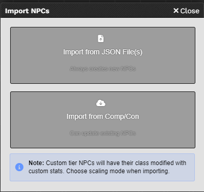

# Lancer NPC Importer

Foundry VTT macro to import Lancer NPCs from Comp/Con.

## Installation

1. Copy the content of [macro.js](./macro.js) into a new Foundry VTT macro
2. Type: Script
3. Run the macro

## Usage

**Import from JSON files:**
- Click "Import from JSON File(s)"
- Choose custom tier scaling mode (Scaled or Flat)
- Select your .json files

**Import from Comp/Con Cloud:**
- Login to Comp/Con in Foundry (Settings → System Settings → COMP/CON Login)
- Click "Import from Comp/Con"
- Choose scaling mode and select NPCs

## Features

- Import from JSON files or Comp/Con cloud
- Update existing NPCs (preserves tokens/images)
- Search and filter NPCs
- **Custom tier support:**
  - **Scaled**: Maintains tier increments (e.g., 0/2/4 from base 10/12/14)
  - **Flat**: Same stats all tiers (e.g., 0/0/0)
  - Automatically adds "CUSTOM" to class name

 