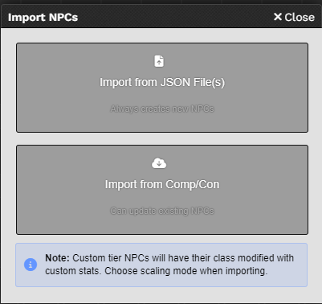

# Lancer NPC Import

[](https://github.com/Agraael/Lancer-vtt-NPC-import-Macro/releases/latest)

<br/>
[)](https://github.com/Agraael/Lancer-vtt-NPC-import-Macro/releases/latest)
[)](https://github.com/Agraael/Lancer-vtt-NPC-import-Macro/releases/latest)

---

Pulls Lancer content out of Comp/Con and into FoundryVTT. The name says NPC import, but at this point it does a bit more than that - see below.

## What it does

- **NPC import** from Comp/Con cloud or JSON files, with tier scaling and update-in-place.
- **Pilot import patch**: makes the built-in Lancer pilot import also bring in reserves and organizations (the system drops those by default).
- **Pilot share code patch**: the 12-character codes that the new Comp/Con hands out work in the pilot sheet again.
- **Pilot cloud sync patch**: the pilot dropdown in the Lancer system pulls from the new Comp/Con.
- **V3 LCP import**: open the Compendium Manager, pick a v3 `.lcp` file, and an **Import v3 LCP** button appears in place of the native one. Click it and the content is translated and imported in one step — no file conversion or re-upload.

The three pilot-side patches run automatically as long as the V3 setting is on (it is, by default).

## Install

Manifest URL:

```
https://github.com/Agraael/Lancer-vtt-NPC-import-Macro/releases/latest/download/module.json
```

Requires:
- [Lancer system](https://foundryvtt.com/packages/lancer) v2.0.0+
- [Lancer Style Library](https://github.com/Agraael/lancer-style-library)

## Using it

Click **Import NPCs** in the Actors sidebar.

- **From the cloud**: log in under Settings > Lancer System Settings > COMP/CON Login, then pick NPCs and a scaling mode.
- **From JSON**: export from Comp/Con, pick the files, pick a scaling mode. Both v2 and v3 export formats are handled.

For NPCs with custom tiers:
- **Scaled** keeps the tier-to-tier increments (custom base + tier delta).
- **Flat** uses the same custom stats for every tier.

Custom stats are detected by comparing against the class base, so it still works when Comp/Con doesn't flag the tier as "custom".



## V3 LCP notes

The button only appears when the selected `.lcp` is actually v3. v2 LCPs use the normal import path unchanged.

A few v3-only features have no Lancer VTT equivalent and get handled as follows:
- **Eidolon layers**: dropped.
- **Structured automation** (`active_effects`): lifted into native `bonuses` / `actions` / `deployables` where shapes match; anything else gets appended as readable text on the item's effect.
- **Status/resistance grants** (`add_status`, `add_resist`): appended as text (Lancer has no way to apply these from LCP JSON).

The badge counts shown above the button are a preview of what will be imported.

## About the V3 switch

Comp/Con moved to a new backend in April 2026. The old `api.compcon.app/share` endpoint is gone, the legacy site lives on at `old.compcon.app`, and the new site (`compcon.app`) is V3. The V3 patch is on by default because nothing pilot- or NPC-related works against the current Lancer system without it. Only turn it off if you're running your own V2 server.

<details>
<summary>Advanced: endpoint overrides</summary>

If Massif rotates keys or moves hosts, five world settings let you update things without waiting for a module release. World reload required after changing any of them.

- `V3 API Base URL`
- `V3 API Key`
- `V3 CDN Base URL`
- `V2 Share API URL` (comma-separated; covers both the old `api.compcon.app/share` and the `ujgatmvzlg` gateway `old.compcon.app` uses)
- `V2 Share API Key`

</details>
