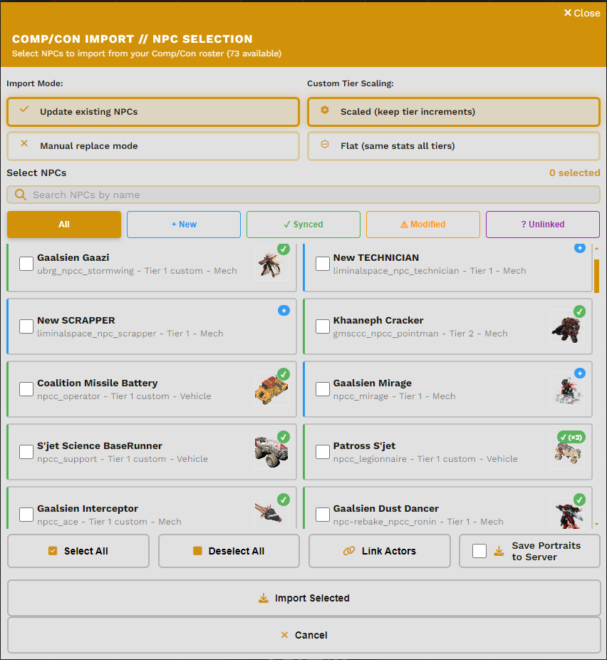

# Lancer NPC Import

[](https://github.com/Agraael/Lancer-vtt-NPC-import-Macro/releases/latest)

<br/>
[)](https://github.com/Agraael/Lancer-vtt-NPC-import-Macro/releases/latest)
[)](https://github.com/Agraael/Lancer-vtt-NPC-import-Macro/releases/latest)

---

Pulls Lancer content out of Comp/Con and into FoundryVTT. The name says NPC import, but at this point it does a bit more than that.

## What it does

- **NPC import** from Comp/Con cloud or JSON files, with tier scaling and update-in-place.
- **Comp/Con sign in**: Lancer v2.12 dropped the built-in login, so we talk to AWS Cognito directly. Only a refresh token is stored, never your password.
- **Pilot import patch**: brings in organizations, fills bonds, and refills HP/structure/stress on import. Reserves are deduped by LID so the new system's native reserves import doesn't double up.
- **V3 LCP import**: open the Compendium Manager, pick a v3 `.lcp` file, and an **Import v3 LCP** button appears in place of the native one.
- **Refresh items from LCPs**: re-pull compendium item data into existing actors after an LCP update, with a per-item diff preview and per-row opt-in.

Pilot share codes and pilot cloud sync are now handled by the Lancer system itself.

## Install

Manifest URL:

```
https://github.com/Agraael/Lancer-vtt-NPC-import-Macro/releases/latest/download/module.json
```

Requires:
- [Lancer system](https://foundryvtt.com/packages/lancer) v2.12.0+
- [Lancer Style Library](https://github.com/Agraael/lancer-style-library)

## Using it

Click **Import NPCs** in the Actors sidebar.

- **From the cloud**: hit **Sign in** in the dialog, enter your Comp/Con credentials, then pick NPCs and a scaling mode.
- **From JSON**: export from Comp/Con, pick the files, pick a scaling mode. Both v2 and v3 export formats are handled.

For NPCs with custom tiers:
- **Scaled** keeps the tier-to-tier increments (custom base + tier delta).
- **Flat** uses the same custom stats for every tier.

Custom stats are detected by comparing against the class base, so it still works when Comp/Con doesn't flag the tier as "custom".



## V3 LCP notes

Button only shows up for v3 LCPs. v2 LCPs go through the normal Lancer importer.

| v3 feature | Handling |
|---|---|
| `active_effects[]` bonuses / actions / deployables / synergies / counters | Lifted into the item's v2 arrays |
| Action-shaped `active_effects[]` (damage / range / attack / condition / frequency) | Synthesized as v2 actions |
| `save` (scalar or `.dc`) / `accuracy` / `bonus_damage` scalars | Lifted into bonuses |
| `on_attack` / `on_hit` / `on_crit` / `on_miss` as objects | String-coerced; `on_attack` / `on_crit` merged into effect |
| `damage[].val` → `damage[].damage` | Renamed |
| NPC weapon tier arrays | Pass-through (Lancer handles natively) |
| Inline `integrated` items | Flattened to LID strings |
| `core_system.active_effects[]` / `passive_effects[]` | Fanned into `active_bonuses` / `active_actions` / `active_synergies` (+ passive) plus core `deployables` / `counters` |
| `add_status` / `add_resist` / `add_special` / `remove_special` | Text in effect (Lancer doesn't apply statuses from LCPs) |
| `duration` / `condition` / `target` (non-action AEs) | Text meta in header |
| `damage` / `bonus_damage` on non-action AEs | Text in effect |
| Structured `save.on_success` / `on_fail` | Text in effect (DC still goes to bonus) |
| Eidolon layers | Each layer → NPC template + features in an `Eidolons` folder. Apply manually, no layer-swap |
| `flavorDescription` / `brew` / `deprecated` | Dropped |

Translation summary in the LCP Manager shows per-bucket counts and how many AE blocks went structured vs text.


## Refresh items from LCPs

Re-pulls updated compendium items onto existing actors, with a per-item diff and opt-in.

Per actor: **Refresh** button in the actor sheet title bar.
Bulk: **Refresh actors** button in the Actors sidebar.


## V3 LCP diff tool

There are way too many LCPs out there for me to test them all, so some translation edge cases probably slipped through. To help with that, I added a diff tool in the module configuration.

Open **Module Settings → Lancer NPC Import → Open LCP Diff Tool**, pick two LCPs, and you get a side-by-side breakdown: per-bucket counts, added/removed/changed entries, and field-level diffs on the items that changed. Nothing is actually imported.

Mainly useful for LCP authors who want to sanity-check that their v3 pack translates the way they expect, but it also gives me something concrete to look at when someone reports a bad import.


## A note on CORS

The V3 Comp/Con API doesn't allow direct browser calls, so the module routes calls through a CORS proxy: corsproxy.io for localhost, my Cloudflare Worker for everyone else.

If a red notification says the Worker isn't responding, it's hit its daily limit. Try again in a few hours.

**Bonus:** the Lancer v2.12 system's own pilot share-code button hits `api.compcon.app/v3/code` directly and gets blocked by the same CORS rule. Installing this module silently routes that call through the proxy too, so the system's native share-code import starts working again. Real fix would be Comp/Con adding `Access-Control-Allow-Origin: *` on `/v3/code` and `/share`.


<details>
<summary>Advanced: endpoint overrides</summary>

If Massif rotates keys or moves hosts, you can update these endpoints in the settings without waiting for a module release. Reload the world after changing any of them.

- `V3 API Base URL`
- `V3 API Key`
- `V3 CDN Base URL`

</details>


---

<details>
<summary>patreon...</summary>

Well, project became bigger, now there's more people. So the Patreon is starting to get real. If you wanna support my late nights, that's here.

In any case, my stuff would always be free, and if I stop working on it, I'll just close that thing. [Patreon](https://www.patreon.com/cw/LaSossis)

</details>

Check out my other modules and tools: [List of stuff](https://www.patreon.com/posts/list-of-stuff-149377511)
